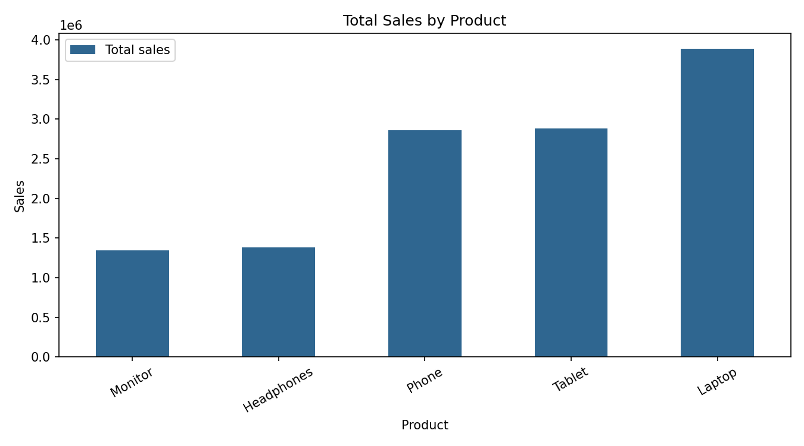
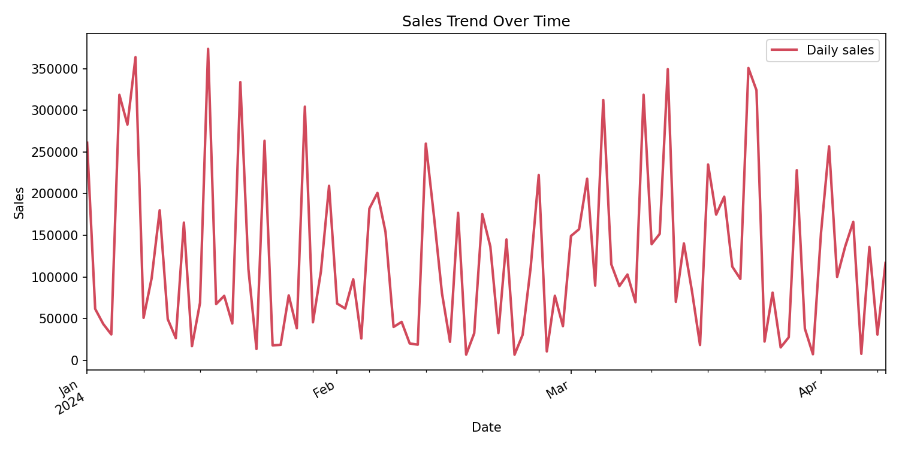
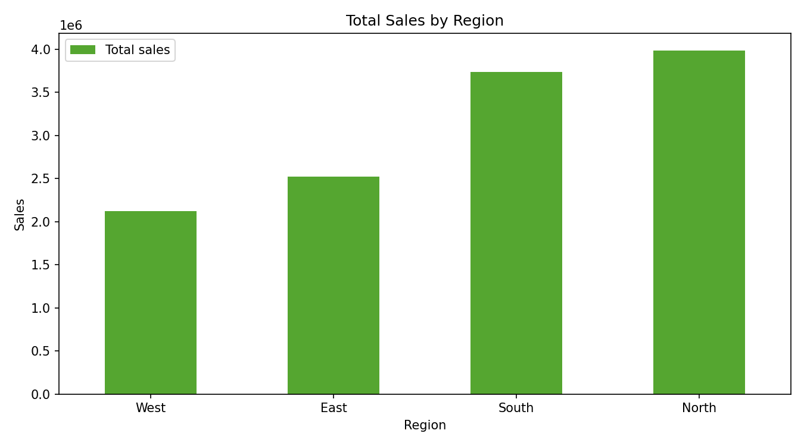
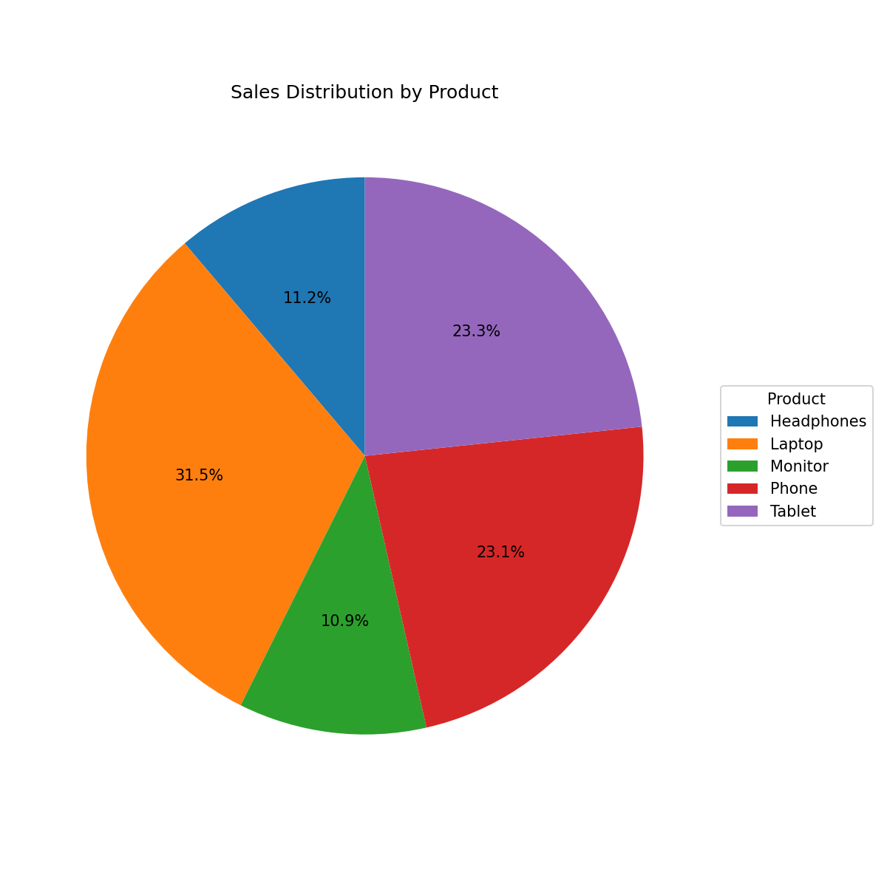

# Week 4 – Complete Data Analysis Project

## 1. Project Overview

This Week 4 project for The Developers Arena internship demonstrates a complete data analysis and visualization workflow: loading real data, cleaning it, analyzing sales, creating charts, and presenting written insights.

## 2. Project Objectives

- Load real-world sales data.
- Clean and validate data.
- Explore the dataset.
- Analyze sales performance.
- Create visualizations.
- Extract useful business insights.
- Present results professionally.

## 3. Dataset Description

The project uses the provided `sales_data.csv` without modifying the original source data.

- Rows: 100
- Columns: 7
- Column names: `Date`, `Product`, `Quantity`, `Price`, `Customer_ID`, `Region`, `Total_Sales`
- Date range: 2024-01-01 to 2024-04-09
- Products: Phone, Headphones, Laptop, Tablet, Monitor
- Regions: East, North, West, South

`Quantity`, `Price`, and `Total_Sales` contain numeric sales information. `Product` and `Region` support grouped comparisons. `Date` supports the time trend chart.

## 4. Technologies Used

- Python
- Pandas
- Matplotlib
- Visual Studio Code
- Git
- GitHub

## 5. Project Structure

```text
Task_4_DataVis_1stProject/
├── main.py
├── sales_data.csv
├── requirements.txt
├── data/
├── visualizations/
│   ├── sales_by_product.png
│   ├── sales_trend.png
│   ├── sales_by_region.png
│   └── sales_distribution_by_product.png
├── report/
│   └── analysis_report.md
└── screenshots/
```

## 6. Setup Instructions

From this project folder, install dependencies:

```text
pip install -r requirements.txt
```

Run the project:

```text
python main.py
```

## 7. Data Loading

The program loads the provided CSV with Pandas using `pd.read_csv()`. The file path is resolved relative to `main.py`, so the program can be run from the project folder or repository root.

## 8. Data Cleaning

- Missing values found: 0
- Duplicate rows found: 0
- Numeric fields were validated with numeric conversion.
- The date field was converted from text to Pandas datetime values.
- No rows needed to be removed for this dataset.
- Cleaning is performed on an in-memory copy; the source CSV is not overwritten.

The program also validates that the CSV exists, is not empty, contains the required columns, and has valid numeric and date values.

## 9. Exploratory Data Analysis

- Dataset shape: `(100, 7)`
- First five rows include Phone, Headphones, Phone, Headphones, and Laptop records.
- Data types from the source file: `Date`, `Product`, `Customer_ID`, and `Region` were text; `Quantity`, `Price`, and `Total_Sales` were `int64`.
- Numeric descriptive statistics:

| Statistic | Quantity |     Price | Total_Sales |
| --------- | -------: | --------: | ----------: |
| Count     |      100 |       100 |         100 |
| Mean      |     4.78 | 25,808.51 |  123,650.48 |
| Minimum   |        1 |     1,308 |       6,540 |
| Median    |     5.00 |    24,192 |   97,955.50 |
| Maximum   |        9 |    49,930 |     373,932 |

## 10. Sales Analysis

| Metric           | Actual result |
| ---------------- | ------------: |
| Total sales      | 12,365,048.00 |
| Average sale     |    123,650.48 |
| Maximum sale     |    373,932.00 |
| Minimum sale     |      6,540.00 |
| Total quantity   |           478 |
| Unique products  |             5 |
| Unique customers |           100 |

### Sales by product

| Product    | Total sales |
| ---------- | ----------: |
| Laptop     |   3,889,210 |
| Tablet     |   2,884,340 |
| Phone      |   2,859,394 |
| Headphones |   1,384,033 |
| Monitor    |   1,348,071 |

Laptop is the best-selling product by total sales.

### Sales by region

| Region | Total sales |
| ------ | ----------: |
| North  |   3,983,635 |
| South  |   3,737,852 |
| East   |   2,519,639 |
| West   |   2,123,922 |

### Sales trend over time

The dataset contains daily records from 2024-01-01 through 2024-04-09. The line chart plots daily `Total_Sales` values in date order so changes in sales can be inspected across the period.

## 11. Visualizations

### Visualization 1 – Sales by Product

The bar chart compares total revenue for each product. Laptop leads the dataset, while Monitor has the lowest total sales.



### Visualization 2 – Sales Trend Over Time

The line chart shows daily sales from January through April 2024. It makes day-to-day variation and high or low sales dates visible.



### Visualization 3 – Sales by Region

The regional bar chart compares revenue across the four available regions. North has the highest regional total.



### Visualization 4 – Sales Distribution by Product

The pie chart shows each product's percentage share of total sales. It provides a quick view of how the overall revenue is distributed across the five products.



## 12. Key Insights

- Total revenue was **12,365,048.00** across 100 records.
- Laptop was the strongest product by revenue at **3,889,210**.
- North was the highest-performing region at **3,983,635**.
- The average transaction was **123,650.48**.
- Monitor and Headphones had the lowest product totals, so they may need closer performance review.
- The time chart provides a direct view of daily variation from January 1 through April 9, 2024.

## 13. Technical Requirements Fulfilled

- Complete pipeline: load, inspect, clean, analyze, and visualize.
- Pandas handles loading, validation, cleaning, grouping, and calculations.
- Matplotlib creates four PNG charts using three different chart types: bar, line, and pie.
- Written insights are based on the actual dataset results.
- Error handling covers missing files, empty files, parsing problems, missing columns, invalid numeric values, invalid dates, and empty cleaned data.
- Comments explain important loading and cleaning steps.
- The report and output use professional labels and formatting.

## 14. Testing

Normal execution was tested with:

```text
python Task_4_DataVis_1stProject\main.py
```

Observed results:

- The dataset loaded successfully.
- The shape, columns, data types, first rows, and descriptive statistics printed.
- Missing values and duplicates were reported as zero.
- The analysis produced the verified sales metrics and findings in this report.
- Four PNG charts were generated successfully in `visualizations/`, including the product sales distribution pie chart.
- The program exited without errors.

The validation functions also include explicit paths for missing files, empty datasets, missing required columns, invalid numeric values, and invalid dates. These error paths should be exercised manually if additional screenshots are required.

## 15. Visual Documentation

Screenshots are not fabricated or included. Capture these manually:

1. Dataset loaded in VS Code.
2. Terminal showing analysis execution.
3. Final analysis output.
4. Generated visualizations.
5. Optional validation/error-handling output.

[INSERT SCREENSHOT HERE]

[INSERT SCREENSHOT HERE]

[INSERT SCREENSHOT HERE]

## 16. What I Learned

This project demonstrated a complete data analysis workflow with Pandas and Matplotlib, including data loading, validation, cleaning, exploration, aggregation, chart creation, business insight writing, error handling, and professional documentation.

## 17. Conclusion

The project successfully analyzed the real sales dataset and produced four useful visualizations. The results identify Laptop as the top product and North as the top region, while the validation and cleaning steps confirm that the provided dataset contains no missing or duplicate records.
